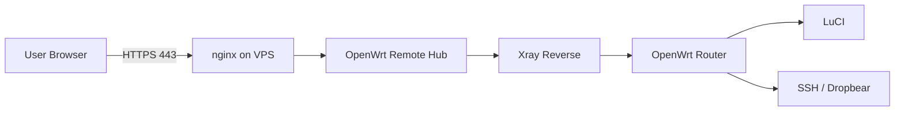
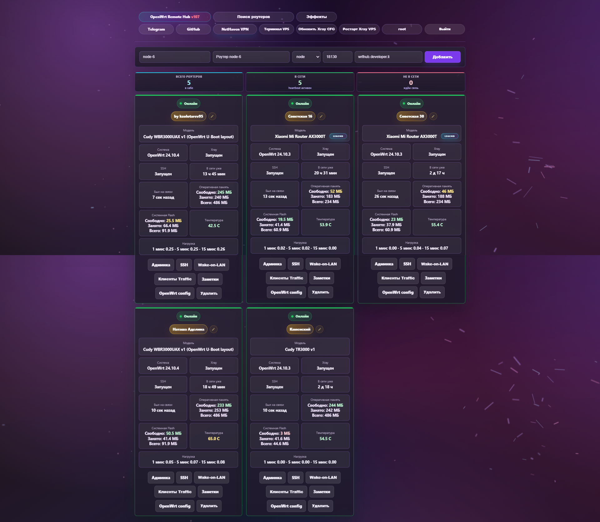
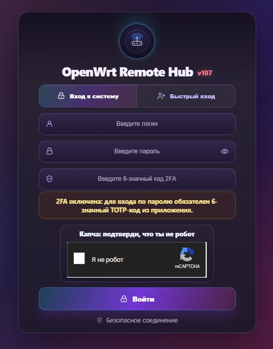
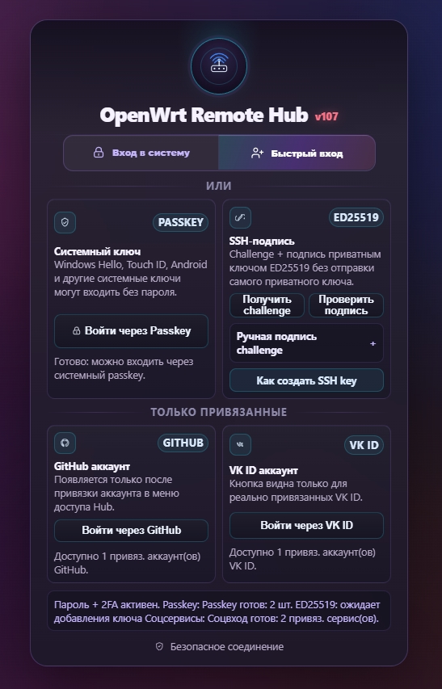
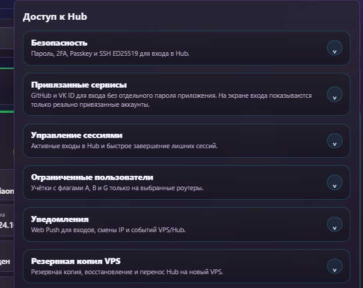
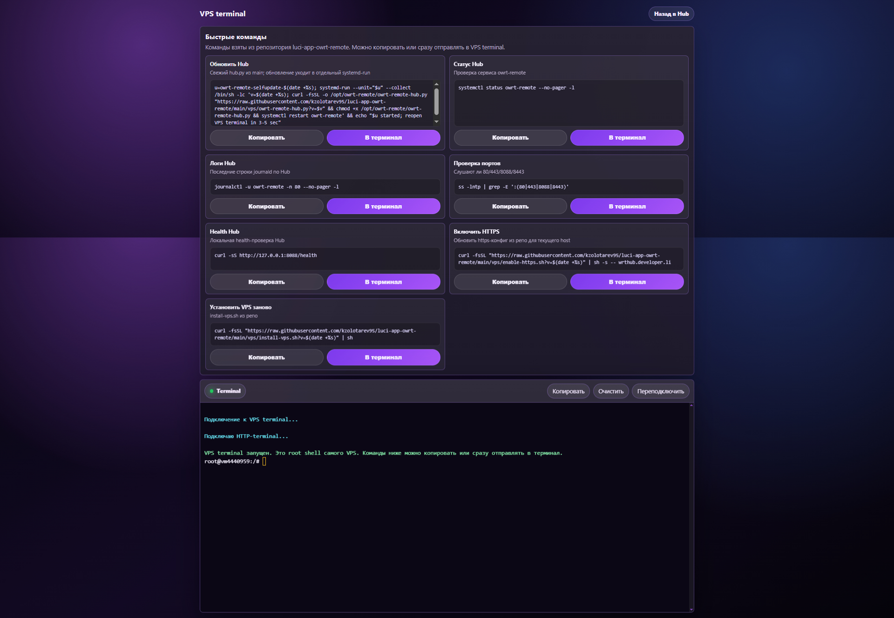
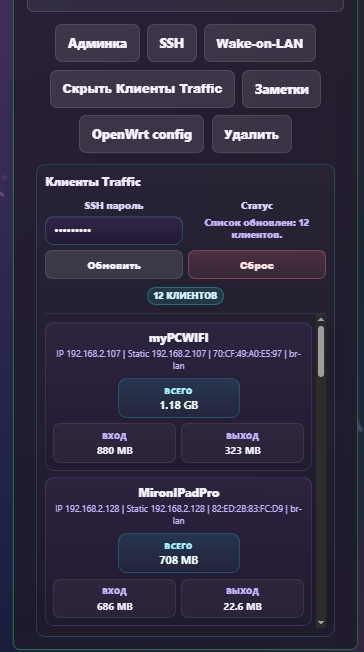
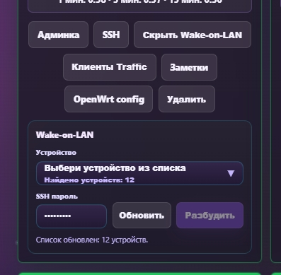
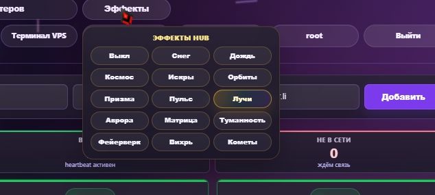

<div align="center">


<p>
  <a href="#-быстрый-старт"></a>
  <a href="#-схема-работы"></a>
  <a href="#-https--ssl"></a>
  <a href="#-частые-проблемы"></a>
</p>

<p>
  
  
  
  
  
  
  
</p>

<h3>Удалённый доступ к OpenWrt через свой VPS</h3>

<p>
  Карточки роутеров · Online/Offline · LuCI · SSH Web Terminal · Xray Reverse · HTTPS через nginx
</p>

</div>

---

<div align="center">

<h2> Что это такое</h2>

<p>
<b>OpenWrt Remote Hub</b> — это связка из VPS-панели и OpenWrt-агента, которая даёт удобный удалённый доступ к роутерам без проброса LuCI и SSH наружу.<br>
Роутер сам подключается к VPS изнутри сети, а ты заходишь в Hub-панель и открываешь нужный роутер, LuCI или SSH Web Terminal.
</p>


<table>
<tr>
<td width="50%" align="center">

<h3> Для чего</h3>

удалённо открыть LuCI  
зайти в SSH через браузер  
видеть Online/Offline роутеров  
держать всё за HTTPS  
не светить домашнюю сеть наружу

</td>
<td width="50%" align="center">

<h3> Из чего состоит</h3>

VPS Hub-панель  
OpenWrt агент  
Xray reverse-туннели  
nginx HTTPS proxy  
firewall automation  
web terminal

</td>
</tr>
</table>

</div>

---

<div align="center">

<h2> Tech Stack</h2>

<h3> Router / Network / OpenWrt</h3>

<p>
  
  
  
  
</p>

<h3> VPS / Reverse / HTTPS</h3>

<p>
  
  
  
  
  
</p>

</div>

---

<div align="center">

---

<div align="center">

<h2> Сообщество NetHaven VPN Обсуждение </h2>

Есть вопросы, идеи или нужна помощь с настройкой?

Присоединяйтесь к чату пользователей **OpenWrt Remote Hub**, где можно:

 задать вопрос по установке  
 обсудить настройку VPS и OpenWrt  
 сообщить об ошибке  
 предложить новые функции  
 поделиться своим опытом использования

<br>

<a href="https://t.me/+LZDsQJhUfcNhYWEy">
  
</a>

<br><br>

<b> Чат и обсуждения проекта</b>

</div>

---

<h2> Быстрый старт</h2>

После установки в конце появится вход:

```text
login:    admin
password: admin
```

Пароль лучше поменять сразу после первого входа.

<h3> VPS: поставить Hub, Xray, firewall и HTTPS одной командой</h3>

```sh
curl -fsSL "https://raw.githubusercontent.com/kzolotarev95/luci-app-owrt-remote/main/vps/install-vps.sh?v=$(date +%s)" | sudo sh
```

Установщик спросит:

```text
IP/домен VPS:
```

Можно вставить домен, например:

```text
hub.example.com
```

Или просто нажать <b>Enter</b>, чтобы взять найденный IP сервера.

<h3> OpenWrt: поставить Remote Hub на роутер</h3>

```sh
wget -O - "https://raw.githubusercontent.com/kzolotarev95/luci-app-owrt-remote/main/install.sh?v=$(date +%s)" | sh
```

Проверка на роутере:

```sh
owrt-remote doctor
owrt-remote status
```

</div>

---

<div align="center">

<h2> Схема работы</h2>

</div>



<div align="center">

<b>Главная идея:</b> роутер сам подключается к VPS изнутри сети. Наружу LuCI и SSH на роутере открывать не нужно.

</div>

---

<div align="center">

<h2> Скриншоты интерфейса</h2>

<table>
<tr>
<td align="center">



<br>
<b>Hub-панель</b>
<br>
<sub>Карточки роутеров, статусы Online/Offline, LuCI, SSH, OpenWrt config и Client JSON.</sub>

</td>
</tr>
</table>

<table>
<tr>
<td width="50%" align="center">



<br>
<b>Вход по паролю + 2FA</b>
<br>
<sub>Основной экран входа в Hub: логин, пароль, 6-значный TOTP-код и reCAPTCHA.</sub>

</td>
<td width="50%" align="center">



<br>
<b>Быстрый вход</b>
<br>
<sub>Passkey, SSH ED25519 подпись и вход через привязанные GitHub / VK ID аккаунты.</sub>

</td>
</tr>
<tr>
<td width="50%" align="center">



<br>
<b>Безопасность и доступ</b>
<br>
<sub>Пароль, 2FA, Passkey, SSH ED25519, привязанные сервисы, ограниченные пользователи и уведомления.</sub>

</td>
<td width="50%" align="center">



<br>
<b>VPS Terminal</b>
<br>
<sub>Веб-терминал VPS с быстрыми командами для обслуживания Hub, Xray, HTTPS и диагностики сервиса.</sub>

</td>
</tr>
<tr>
<td width="50%" align="center">



<br>
<b>Клиенты Traffic</b>
<br>
<sub>Список клиентов роутера с SSH-опросом и счетчиками входящего/исходящего трафика прямо в Hub.</sub>

</td>
<td width="50%" align="center">



<br>
<b>Wake-on-LAN</b>
<br>
<sub>Пробуждение устройств по MAC-адресу прямо из карточки роутера без отдельной админки.</sub>

</td>
</tr>
<tr>
<td width="50%" align="center">



<br>
<b>Эффекты Hub</b>
<br>
<sub>Набор визуальных эффектов интерфейса: снег, дождь, орбиты, туманность, лучи и другие режимы.</sub>

</td>
<td width="50%" align="center">


<br>
<b>Карточки роутеров</b>
<br>
<sub>Живые карточки со статусом, моделью, памятью, температурой, SSH, LuCI и быстрыми действиями.</sub>

</td>
</tr>
</table>

</div>

---

---

<div align="center">

<h2> Обзор панели и настройка</h2>

<b>Обзор панели и настройка</b><br>
<sub>Открытие Hub с ПК: статус роутера, LuCI и SSH Web Terminal.</sub>

<br><br>

<a href="https://youtu.be/BCVIQgHkbYA?si=BDRAt2uyqRwz8A2Y" target="_blank">
  
</a>

<br><br>

<a href="https://youtu.be/BCVIQgHkbYA?si=BDRAt2uyqRwz8A2Y">
  
</a>

<br><br>

</div>

---

<div align="center">

<h2> Видео-демо</h2>

<b>Видео дизайн обзор</b>
<br>
<sub>Открытие Hub с телефона: статус роутера, LuCI и SSH Web Terminal.</sub>

<br><br>

<video src="https://github.com/user-attachments/assets/f7990b3c-2cfe-4fbf-bb01-c846102e1c94" width="360" controls></video>

</div>

---

<div align="center">

<h2> Возможности</h2>

<table>
<tr>
<th align="center">Возможность</th>
<th align="center">Описание</th>
</tr>
<tr>
<td align="center"> <b>Router Cards</b></td>
<td align="center">Карточки роутеров в Hub-панели</td>
</tr>
<tr>
<td align="center"> <b>Online / Offline</b></td>
<td align="center">Быстрая проверка состояния роутеров</td>
</tr>
<tr>
<td align="center"> <b>LuCI через VPS</b></td>
<td align="center">Доступ к LuCI без прямого проброса портов</td>
</tr>
<tr>
<td align="center"> <b>SSH Web Terminal</b></td>
<td align="center">SSH в браузере, удобно даже с телефона</td>
</tr>
<tr>
<td align="center"> <b>Xray Reverse</b></td>
<td align="center">Роутер подключается к VPS сам</td>
</tr>
<tr>
<td align="center"> <b>HTTPS через nginx</b></td>
<td align="center">TLS-точка входа на <code>443/tcp</code></td>
</tr>
<tr>
<td align="center"> <b>Firewall automation</b></td>
<td align="center">Скрипты помогают открыть нужные порты</td>
</tr>
<tr>
<td align="center"> <b>Doctor / Status</b></td>
<td align="center">Команды диагностики на OpenWrt</td>
</tr>
</table>

</div>

---

<div align="center">

<h2> Подробная установка</h2>

</div>

<details>
<summary align="center"><b> Установка VPS подробно</b></summary>

<div align="center">

Если хочешь поставить повторно, но не сбрасывать текущий пароль:

</div>

```sh
curl -fsSL "https://raw.githubusercontent.com/kzolotarev95/luci-app-owrt-remote/main/vps/install-vps.sh?v=$(date +%s)" | sudo env RESET_LOGIN=0 sh
```

<div align="center">

Если HTTPS не включился автоматически, HTTP-панель всё равно остаётся рабочей. После проверки firewall можно запустить:

</div>

```sh
curl -fsSL "https://raw.githubusercontent.com/kzolotarev95/luci-app-owrt-remote/main/vps/enable-https.sh?v=$(date +%s)" | sudo sh -s -- YOUR_VPS_IP
```

</details>

<details>
<summary align="center"><b> HTTPS / SSL</b></summary>

<div align="center">

Установщик пытается включить HTTPS сам.

<br><br>

Схема такая:

</div>

```text
Internet -> 443/nginx -> Hub -> Xray reverse -> OpenWrt
```

<div align="center">

Hub работает внутри на <code>80</code> и <code>8088</code>, а HTTPS на <code>443</code> принимает nginx и прокидывает запросы в Hub.

<br><br>

Для установки должны быть открыты порты:

</div>

```text
80/tcp    - HTTP-панель и проверка Let's Encrypt
443/tcp   - HTTPS-панель через nginx
8088/tcp  - прямой HTTP-порт Hub, можно закрыть позже в firewall провайдера
8443/tcp  - Xray / reverse endpoint
```

<div align="center">

Включить HTTPS вручную на IP:

</div>

```sh
curl -fsSL "https://raw.githubusercontent.com/kzolotarev95/luci-app-owrt-remote/main/vps/enable-https.sh?v=$(date +%s)" | sudo sh -s -- YOUR_VPS_IP
```

<div align="center">

Включить HTTPS вручную на домен:

</div>

```sh
curl -fsSL "https://raw.githubusercontent.com/kzolotarev95/luci-app-owrt-remote/main/vps/enable-https.sh?v=$(date +%s)" | sudo EMAIL="you@example.com" sh -s -- hub.example.com
```

<div align="center">

Проверка на VPS:

</div>

```sh
sudo ss -lntp | grep -E ':(80|443|8088)\b'
curl -sS http://127.0.0.1:8088/health
curl -k https://127.0.0.1/health
sudo nginx -t
```

<div align="center">

Нормальная картина:

<br><br>

<code>443</code> слушает <code>nginx</code><br>
<code>80</code> и <code>8088</code> слушает <code>python3</code> Hub<br>
certbot ставит auto-renew<br>
скрипт добавляет hook для перезагрузки nginx после обновления сертификата

</div>

</details>

<details>
<summary align="center"><b> Уведомления и мини-лог VPS</b></summary>

<div align="center">

В панели Hub открой кнопку с логином, блок <code>Уведомления</code>, и нажми <code>Включить</code>.

<br><br>

Что пишет Hub:

<br><br>

вход в панель: устройство, браузер и IP<br>
запуск Hub<br>
запуск VPS после перезагрузки<br>
короткую причину прошлого выключения/ребута по журналу VPS

<br><br>

Важно: если VPS полностью выключился или пропал интернет, сам VPS не сможет отправить уведомление в момент падения. Событие появится после следующего запуска, когда Hub снова поднимется.

</div>

</details>

<details>
<summary align="center"><b> Проверка после установки</b></summary>

<div align="center">

На VPS:

</div>

```sh
sudo systemctl status owrt-remote --no-pager -l
sudo systemctl status owrt-remote-xray --no-pager -l
sudo ss -lntp | grep -E ':(80|443|8088|8443|18080|18090|19080|19090)\b'
curl -sS http://127.0.0.1:8088/health
curl -k https://127.0.0.1/health
```

<div align="center">

Должно быть:

<br><br>

<code>owrt-remote</code> active/running<br>
<code>owrt-remote-xray</code> active/running<br>
<code>*:80</code>, <code>*:443</code>, <code>*:8088</code>, <code>*:8443</code><br>
<code>127.0.0.1:18080</code> для LuCI первого роутера<br>
<code>127.0.0.1:19080</code> для SSH первого роутера

<br><br>

На OpenWrt:

</div>

```sh
owrt-remote doctor
owrt-remote status
owrt-remote heartbeat
```

</details>

---

<div align="center">

<h2> Частые проблемы</h2>

</div>

<details>
<summary align="center"><b> Панель VPS не открывается</b></summary>

<div align="center">

Проверь сервисы и порты:

</div>

```sh
sudo systemctl status owrt-remote --no-pager -l
sudo journalctl -u owrt-remote -n 100 --no-pager
sudo ss -lntp | grep -E ':(80|443|8088)\b'
curl -sS http://127.0.0.1:8088/health
```

<div align="center">

Если на VPS <code>curl</code> отвечает <code>{"ok":true}</code>, но снаружи сайт не открывается, проблема почти всегда в firewall VPS-провайдера.

<br><br>

Открой в личном кабинете VPS:

</div>

```text
80/tcp
443/tcp
8088/tcp
8443/tcp
```

</details>

<details>
<summary align="center"><b> Админка пишет <code>proxy error: [Errno 111] Connection refused</code></b></summary>

<div align="center">

Пересобери Xray config:

</div>

```sh
sudo /opt/owrt-remote/owrt-remote-hub.py render-xray --out /etc/xray/owrt-remote.json
sudo systemctl restart owrt-remote-xray
sudo ss -lntp | grep -E ':(18080|18090|19080|19090)\b'
```

</details>

<details>
<summary align="center"><b> SSH web-terminal просит пароль и молчит</b></summary>

<div align="center">

Проверь Dropbear на OpenWrt:

</div>

```sh
/etc/init.d/dropbear status
owrt-remote heartbeat
```

<div align="center">

В телефоне используй поле снизу терминала:

<br><br>

<b>Вставить</b> — вставить текст<br>
<b>Enter</b> — отправить Enter<br>
<b>Отправить</b> — отправить команду или пароль

</div>

</details>

<details>
<summary align="center"><b> С мобильного интернета не открывается</b></summary>

<div align="center">

Пробуй:

</div>

```text
https://YOUR_VPS_IP/
http://YOUR_VPS_IP/
http://YOUR_VPS_IP:8088/
```

<div align="center">

Если по Wi-Fi работает, а через мобильный интернет нет, открой порты в firewall VPS-провайдера и проверь:

</div>

```sh
sudo ss -lntp | grep -E ':(80|443|8088)'
```

</details>

---

<div align="center">

<h2> Удаление</h2>

</div>

<details>
<summary align="center"><b> Удалить Hub с VPS полностью</b></summary>

```sh
curl -fsSL "https://raw.githubusercontent.com/kzolotarev95/luci-app-owrt-remote/main/vps/uninstall-vps.sh?v=$(date +%s)" | sudo sh
```

<div align="center">

Удалится:

<br><br>

<code>owrt-remote</code><br>
<code>owrt-remote-xray</code><br>
<code>/opt/owrt-remote</code><br>
<code>/etc/xray/owrt-remote.json</code><br>
<code>/var/lib/owrt-remote</code><br>
nginx-конфиг HTTPS, certbot renewal hook и старые TLS override-файлы<br>
правила <code>ufw</code> для <code>80/tcp</code>, <code>443/tcp</code>, <code>8088/tcp</code>, <code>8443/tcp</code>

<br><br>

Удалить Hub, но оставить базу роутеров:

</div>

```sh
curl -fsSL "https://raw.githubusercontent.com/kzolotarev95/luci-app-owrt-remote/main/vps/uninstall-vps.sh?v=$(date +%s)" | sudo env PURGE=0 sh
```

<div align="center">

Удалить дополнительно сам Xray binary:

</div>

```sh
curl -fsSL "https://raw.githubusercontent.com/kzolotarev95/luci-app-owrt-remote/main/vps/uninstall-vps.sh?v=$(date +%s)" | sudo env REMOVE_XRAY=1 sh
```

</details>

<details>
<summary align="center"><b> Удалить агент с OpenWrt полностью</b></summary>

```sh
wget -O - "https://raw.githubusercontent.com/kzolotarev95/luci-app-owrt-remote/main/uninstall.sh?v=$(date +%s)" | PURGE=1 sh
```

<div align="center">

Удалится:

<br><br>

<code>/usr/sbin/owrt-remote</code><br>
<code>/etc/init.d/owrt-remote</code><br>
<code>/www/cgi-bin/owrt-remote</code><br>
пункт меню LuCI<br>
rpcd ACL<br>
<code>/etc/config/owrtremote</code><br>
<code>/etc/owrt-remote/web.key</code><br>
<code>/etc/xray/owrt-remote-client.json</code>

<br><br>

Удалить только файлы панели, но оставить конфиг:

</div>

```sh
wget -O - "https://raw.githubusercontent.com/kzolotarev95/luci-app-owrt-remote/main/uninstall.sh?v=$(date +%s)" | sh
```

</details>

---

<div align="center">

<h2> Дерево проекта</h2>

</div>

<details>
<summary align="center"><b>Открыть дерево файлов</b></summary>

```text
.
├── install.sh
│   └── установка агента на OpenWrt
├── uninstall.sh
│   └── удаление агента с OpenWrt
├── files/
│   ├── usr/sbin/owrt-remote
│   │   └── CLI-агент, heartbeat, render-client, doctor
│   ├── etc/init.d/owrt-remote
│   │   └── procd-сервис OpenWrt
│   ├── www/cgi-bin/owrt-remote
│   │   └── веб-панель на роутере
│   ├── usr/share/luci/menu.d/luci-app-owrt-remote.json
│   │   └── пункт меню LuCI: Службы -> OpenWrt Remote
│   └── usr/share/rpcd/acl.d/luci-app-owrt-remote.json
│       └── права LuCI/rpcd
└── vps/
    ├── install-vps.sh
    │   └── установка Hub, Xray, firewall и HTTPS через nginx
    ├── enable-https.sh
    │   └── включение HTTPS/443 через nginx вручную
    ├── uninstall-vps.sh
    │   └── удаление Hub с VPS
    ├── owrt-remote-hub.py
    │   └── веб-панель VPS, карточки, proxy, SSH terminal
    └── owrt-remote.service
        └── systemd-сервис Hub
```

</details>

---

<div align="center">

<h2>🧾 Мини-шпаргалка команд</h2>

<table>
<tr>
<th align="center">Где</th>
<th align="center">Команда</th>
<th align="center">Что делает</th>
</tr>
<tr>
<td align="center">VPS</td>
<td align="center"><code>systemctl status owrt-remote</code></td>
<td align="center">статус Hub</td>
</tr>
<tr>
<td align="center">VPS</td>
<td align="center"><code>systemctl status owrt-remote-xray</code></td>
<td align="center">статус Xray reverse</td>
</tr>
<tr>
<td align="center">VPS</td>
<td align="center"><code>curl -sS http://127.0.0.1:8088/health</code></td>
<td align="center">healthcheck Hub</td>
</tr>
<tr>
<td align="center">VPS</td>
<td align="center"><code>sudo nginx -t</code></td>
<td align="center">проверка nginx-конфига</td>
</tr>
<tr>
<td align="center">OpenWrt</td>
<td align="center"><code>owrt-remote doctor</code></td>
<td align="center">диагностика агента</td>
</tr>
<tr>
<td align="center">OpenWrt</td>
<td align="center"><code>owrt-remote status</code></td>
<td align="center">текущий статус</td>
</tr>
<tr>
<td align="center">OpenWrt</td>
<td align="center"><code>owrt-remote heartbeat</code></td>
<td align="center">отправить heartbeat</td>
</tr>
</table>

</div>

---

<div align="center">

<h2> Лицензия</h2>

<p>
Этот проект распространяется под лицензией <b>MIT</b>.<br>
Можно использовать, копировать, изменять, публиковать и распространять проект при сохранении текста лицензии.
</p>

<a href="LICENSE">
  
</a>

</div>

---

<div align="center">


<br>

<b>OpenWrt Remote Hub</b> — свой VPS, свой доступ, свои роутеры под контролем.

<br><br>


</div>
