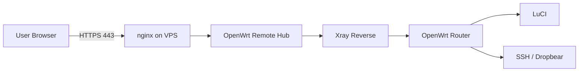

<div align="center">


<p>
  <a href="#-быстрый-старт"></a>
  <a href="#-схема-работы"></a>
  <a href="#-https--ssl"></a>
  <a href="#-частые-проблемы"></a>
</p>

<p>
  
  
  
  
  
  
</p>

<h3>Удалённый доступ к OpenWrt через свой VPS</h3>

<p>
  Карточки роутеров · Online/Offline · LuCI · SSH Web Terminal · Xray Reverse · HTTPS через nginx
</p>

</div>

---

<div align="center">

##  Что это такое

**OpenWrt Remote Hub** — это связка из VPS-панели и OpenWrt-агента, которая даёт удобный удалённый доступ к роутерам без проброса LuCI и SSH наружу.

Роутер сам подключается к VPS изнутри сети, а ты заходишь в Hub-панель и открываешь нужный роутер, LuCI или SSH Web Terminal.

<table>
<tr>
<td width="50%" align="center">

###  Для чего

удалённо открыть LuCI  
зайти в SSH через браузер  
видеть Online/Offline роутеров  
держать всё за HTTPS  
не светить домашнюю сеть наружу

</td>
<td width="50%" align="center">

###  Из чего состоит

VPS Hub-панель  
OpenWrt агент  
Xray reverse-туннели  
nginx HTTPS proxy  
firewall automation  
web terminal

</td>
</tr>
</table>

</div>

---

<div align="center">

##  Tech Stack

### Router / Network / OpenWrt

<p align="center">
  
  
  
  
</p>

### VPS / Reverse / HTTPS

<p align="center">
  
  
  
  
  
</p>

</div>

---

<h2 align="center">⚡ Быстрый старт</h2>

> После установки в конце появится вход:
>
> ```text
> login:    admin
> password: admin
> ```
>
> Пароль лучше поменять сразу после первого входа.

### 1️⃣ VPS: поставить Hub, Xray, firewall и HTTPS одной командой

```sh
curl -fsSL "https://raw.githubusercontent.com/kzolotarev95/luci-app-owrt-remote/main/vps/install-vps.sh?v=$(date +%s)" | sudo sh
```

Установщик спросит:

```text
IP/домен VPS:
```

Можно вставить домен, например:

```text
hub.example.com
```

Или просто нажать **Enter**, чтобы взять найденный IP сервера.

### 2️⃣ OpenWrt: поставить Remote Hub на роутер

```sh
wget -O - "https://raw.githubusercontent.com/kzolotarev95/luci-app-owrt-remote/main/install.sh?v=$(date +%s)" | sh
```

Проверка на роутере:

```sh
owrt-remote doctor
owrt-remote status
```

---

<h2 align="center">🛰️ Схема работы</h2>



**Главная идея:** роутер сам подключается к VPS изнутри сети. Наружу LuCI и SSH на роутере открывать не нужно.

---

<h2 align="center">🎛️ Возможности</h2>

<div align="center">

| Возможность | Описание |
|:---:|:---:|
| 🧭 **Router Cards** | Карточки роутеров в Hub-панели |
| 🟢 **Online / Offline** | Быстрая проверка состояния роутеров |
| 🌐 **LuCI через VPS** | Доступ к LuCI без прямого проброса портов |
| 💻 **SSH Web Terminal** | SSH в браузере, удобно даже с телефона |
| 🔁 **Xray Reverse** | Роутер подключается к VPS сам |
| 🔐 **HTTPS через nginx** | TLS-точка входа на `443/tcp` |
| 🧯 **Firewall automation** | Скрипты помогают открыть нужные порты |
| 🩺 **Doctor / Status** | Команды диагностики на OpenWrt |

---

<h2 align="center">📦 Подробная установка</h2>

<details>
<summary><b>🖥️ Установка VPS подробно</b></summary>

Если хочешь поставить повторно, но не сбрасывать текущий пароль:

```sh
curl -fsSL "https://raw.githubusercontent.com/kzolotarev95/luci-app-owrt-remote/main/vps/install-vps.sh?v=$(date +%s)" | sudo env RESET_LOGIN=0 sh
```

Если HTTPS не включился автоматически, HTTP-панель всё равно остаётся рабочей. После проверки firewall можно запустить:

```sh
curl -fsSL "https://raw.githubusercontent.com/kzolotarev95/luci-app-owrt-remote/main/vps/enable-https.sh?v=$(date +%s)" | sudo sh -s -- YOUR_VPS_IP
```

</details>

<details>
<summary><b>🔐 HTTPS / SSL</b></summary>

Установщик пытается включить HTTPS сам.

Схема такая:

```text
Internet -> 443/nginx -> Hub -> Xray reverse -> OpenWrt
```

Hub работает внутри на `80` и `8088`, а HTTPS на `443` принимает nginx и прокидывает запросы в Hub.

Для установки должны быть открыты порты:

```text
80/tcp    - HTTP-панель и проверка Let's Encrypt
443/tcp   - HTTPS-панель через nginx
8088/tcp  - прямой HTTP-порт Hub, можно закрыть позже в firewall провайдера
8443/tcp  - Xray / reverse endpoint
```

Включить HTTPS вручную на IP:

```sh
curl -fsSL "https://raw.githubusercontent.com/kzolotarev95/luci-app-owrt-remote/main/vps/enable-https.sh?v=$(date +%s)" | sudo sh -s -- YOUR_VPS_IP
```

Включить HTTPS вручную на домен:

```sh
curl -fsSL "https://raw.githubusercontent.com/kzolotarev95/luci-app-owrt-remote/main/vps/enable-https.sh?v=$(date +%s)" | sudo EMAIL="you@example.com" sh -s -- hub.example.com
```

Проверка на VPS:

```sh
sudo ss -lntp | grep -E ':(80|443|8088)\b'
curl -sS http://127.0.0.1:8088/health
curl -k https://127.0.0.1/health
sudo nginx -t
```

Нормальная картина:

- `443` слушает `nginx`;
- `80` и `8088` слушает `python3` Hub;
- certbot ставит auto-renew;
- скрипт добавляет hook для перезагрузки nginx после обновления сертификата.

</details>

<details>
<summary><b>✅ Проверка после установки</b></summary>

На VPS:

```sh
sudo systemctl status owrt-remote --no-pager -l
sudo systemctl status owrt-remote-xray --no-pager -l
sudo ss -lntp | grep -E ':(80|443|8088|8443|18080|18090|19080|19090)\b'
curl -sS http://127.0.0.1:8088/health
curl -k https://127.0.0.1/health
```

Должно быть:

- `owrt-remote` active/running;
- `owrt-remote-xray` active/running;
- `*:80`, `*:443`, `*:8088`, `*:8443`;
- `127.0.0.1:18080` для LuCI первого роутера;
- `127.0.0.1:19080` для SSH первого роутера.

На OpenWrt:

```sh
owrt-remote doctor
owrt-remote status
owrt-remote heartbeat
```

</details>

---

<h2 align="center">🧯 Частые проблемы</h2>

<details>
<summary><b>❌ Панель VPS не открывается</b></summary>

Проверь сервисы и порты:

```sh
sudo systemctl status owrt-remote --no-pager -l
sudo journalctl -u owrt-remote -n 100 --no-pager
sudo ss -lntp | grep -E ':(80|443|8088)\b'
curl -sS http://127.0.0.1:8088/health
```

Если на VPS `curl` отвечает `{"ok":true}`, но снаружи сайт не открывается, проблема почти всегда в firewall VPS-провайдера.

Открой в личном кабинете VPS:

```text
80/tcp
443/tcp
8088/tcp
8443/tcp
```

</details>

<details>
<summary><b>🔌 Админка пишет <code>proxy error: [Errno 111] Connection refused</code></b></summary>

Пересобери Xray config:

```sh
sudo /opt/owrt-remote/owrt-remote-hub.py render-xray --out /etc/xray/owrt-remote.json
sudo systemctl restart owrt-remote-xray
sudo ss -lntp | grep -E ':(18080|18090|19080|19090)\b'
```

</details>

<details>
<summary><b>⌨️ SSH web-terminal просит пароль и молчит</b></summary>

Проверь Dropbear на OpenWrt:

```sh
/etc/init.d/dropbear status
owrt-remote heartbeat
```

В телефоне используй поле снизу терминала:

- **Вставить** — вставить текст;
- **Enter** — отправить Enter;
- **Отправить** — отправить команду или пароль.

</details>

<details>
<summary><b>📱 С мобильного интернета не открывается</b></summary>

Пробуй:

```text
https://YOUR_VPS_IP/
http://YOUR_VPS_IP/
http://YOUR_VPS_IP:8088/
```

Если по Wi‑Fi работает, а через мобильный интернет нет, открой порты в firewall VPS-провайдера и проверь:

```sh
sudo ss -lntp | grep -E ':(80|443|8088)'
```

</details>

---

<h2 align="center">🗑️ Удаление</h2>

<details>
<summary><b>🖥️ Удалить Hub с VPS полностью</b></summary>

```sh
curl -fsSL "https://raw.githubusercontent.com/kzolotarev95/luci-app-owrt-remote/main/vps/uninstall-vps.sh?v=$(date +%s)" | sudo sh
```

Удалится:

- `owrt-remote`;
- `owrt-remote-xray`;
- `/opt/owrt-remote`;
- `/etc/xray/owrt-remote.json`;
- `/var/lib/owrt-remote`;
- nginx-конфиг HTTPS, certbot renewal hook и старые TLS override-файлы;
- правила `ufw` для `80/tcp`, `443/tcp`, `8088/tcp`, `8443/tcp`.

Удалить Hub, но оставить базу роутеров:

```sh
curl -fsSL "https://raw.githubusercontent.com/kzolotarev95/luci-app-owrt-remote/main/vps/uninstall-vps.sh?v=$(date +%s)" | sudo env PURGE=0 sh
```

Удалить дополнительно сам Xray binary:

```sh
curl -fsSL "https://raw.githubusercontent.com/kzolotarev95/luci-app-owrt-remote/main/vps/uninstall-vps.sh?v=$(date +%s)" | sudo env REMOVE_XRAY=1 sh
```

</details>

<details>
<summary><b>📡 Удалить агент с OpenWrt полностью</b></summary>

```sh
wget -O - "https://raw.githubusercontent.com/kzolotarev95/luci-app-owrt-remote/main/uninstall.sh?v=$(date +%s)" | PURGE=1 sh
```

Удалится:

- `/usr/sbin/owrt-remote`;
- `/etc/init.d/owrt-remote`;
- `/www/cgi-bin/owrt-remote`;
- пункт меню LuCI;
- rpcd ACL;
- `/etc/config/owrtremote`;
- `/etc/owrt-remote/web.key`;
- `/etc/xray/owrt-remote-client.json`.

Удалить только файлы панели, но оставить конфиг:

```sh
wget -O - "https://raw.githubusercontent.com/kzolotarev95/luci-app-owrt-remote/main/uninstall.sh?v=$(date +%s)" | sh
```

</details>

---

<h2 align="center">🌳 Дерево проекта</h2>

<details>
<summary><b>Открыть дерево файлов</b></summary>

```text
.
├── install.sh
│   └── установка агента на OpenWrt
├── uninstall.sh
│   └── удаление агента с OpenWrt
├── files/
│   ├── usr/sbin/owrt-remote
│   │   └── CLI-агент, heartbeat, render-client, doctor
│   ├── etc/init.d/owrt-remote
│   │   └── procd-сервис OpenWrt
│   ├── www/cgi-bin/owrt-remote
│   │   └── веб-панель на роутере
│   ├── usr/share/luci/menu.d/luci-app-owrt-remote.json
│   │   └── пункт меню LuCI: Службы -> OpenWrt Remote
│   └── usr/share/rpcd/acl.d/luci-app-owrt-remote.json
│       └── права LuCI/rpcd
└── vps/
    ├── install-vps.sh
    │   └── установка Hub, Xray, firewall и HTTPS через nginx
    ├── enable-https.sh
    │   └── включение HTTPS/443 через nginx вручную
    ├── uninstall-vps.sh
    │   └── удаление Hub с VPS
    ├── owrt-remote-hub.py
    │   └── веб-панель VPS, карточки, proxy, SSH terminal
    └── owrt-remote.service
        └── systemd-сервис Hub
```

</details>

---

<h2 align="center"> Мини-шпаргалка команд</h2>

<div align="center">

| Где | Команда | Что делает |
|:---:|:---:|:---:|
| VPS | `systemctl status owrt-remote` | статус Hub |
| VPS | `systemctl status owrt-remote-xray` | статус Xray reverse |
| VPS | `curl -sS http://127.0.0.1:8088/health` | healthcheck Hub |
| VPS | `sudo nginx -t` | проверка nginx-конфига |
| OpenWrt | `owrt-remote doctor` | диагностика агента |
| OpenWrt | `owrt-remote status` | текущий статус |
| OpenWrt | `owrt-remote heartbeat` | отправить heartbeat |

</div>

---

<div align="center">


<br>

<b>OpenWrt Remote Hub</b> — свой VPS, свой доступ, свои роутеры под контролем.


</div>
