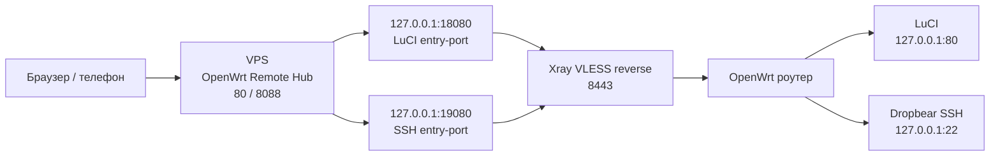

<div align="center">

# OpenWrt Remote Hub

Удаленный доступ к OpenWrt через свой VPS: карточки роутеров, online/offline, LuCI-админка, SSH web-terminal и Xray VLESS reverse-туннели.

[Telegram](https://t.me/kzolotarev95) · [GitHub](https://github.com/kzolotarev95) · [NetHaven VPN](https://t.me/+LZDsQJhUfcNhYWEy)

</div>

## Что это

`OpenWrt Remote Hub` - это легкая панель для удаленного доступа к OpenWrt через свой VPS.
Роутер сам подключается к VPS изнутри сети, поэтому наружу LuCI и SSH на роутере открывать не нужно.

## Схема работы



В панели VPS можно:

- видеть все роутеры красивыми карточками;
- смотреть online/offline, модель, OpenWrt, Xray, uptime, RAM, flash, температуру и load;
- открывать LuCI кнопкой `Админка`;
- открывать SSH прямо в браузере кнопкой `SSH`;
- получать готовые OpenWrt config-команды для каждого роутера;
- обновлять и перезапускать Xray на VPS кнопками в панели.

Первый вход в Hub:

```text
логин: admin
пароль: admin
```

Пароль можно поменять в панели Hub.

## Дерево проекта

```text
.
├── install.sh
│   └── установка агента на OpenWrt
├── uninstall.sh
│   └── удаление агента с OpenWrt
├── files/
│   ├── usr/sbin/owrt-remote
│   │   └── CLI-агент, heartbeat, render-client, doctor
│   ├── etc/init.d/owrt-remote
│   │   └── procd-сервис OpenWrt
│   ├── www/cgi-bin/owrt-remote
│   │   └── веб-панель на роутере
│   ├── usr/share/luci/menu.d/luci-app-owrt-remote.json
│   │   └── пункт меню LuCI: Службы -> OpenWrt Remote
│   └── usr/share/rpcd/acl.d/luci-app-owrt-remote.json
│       └── права LuCI/rpcd
└── vps/
    ├── install-vps.sh
    │   └── установка Hub на VPS одной командой
    ├── uninstall-vps.sh
    │   └── удаление Hub с VPS одной командой
    ├── enable-https.sh
    │   └── включение HTTPS/443 для Hub
    ├── owrt-remote-hub.py
    │   └── веб-панель VPS, карточки роутеров, proxy, SSH terminal
    └── owrt-remote.service
        └── systemd-сервис Hub
```

## Быстрые команды

| Задача | Где запускать | Команда |
| --- | --- | --- |
| Поставить Hub | VPS | `curl -fsSL "https://raw.githubusercontent.com/kzolotarev95/luci-app-owrt-remote/main/vps/install-vps.sh?v=$(date +%s)" \| sudo sh` |
| Включить HTTPS | VPS | `curl -fsSL "https://raw.githubusercontent.com/kzolotarev95/luci-app-owrt-remote/main/vps/enable-https.sh?v=$(date +%s)" \| sudo sh -s -- YOUR_VPS_IP` |
| Поставить агент | OpenWrt | `wget -O - "https://raw.githubusercontent.com/kzolotarev95/luci-app-owrt-remote/main/install.sh?v=$(date +%s)" \| sh` |
| Удалить Hub полностью | VPS | `curl -fsSL "https://raw.githubusercontent.com/kzolotarev95/luci-app-owrt-remote/main/vps/uninstall-vps.sh?v=$(date +%s)" \| sudo sh` |
| Удалить агент полностью | OpenWrt | `wget -O - "https://raw.githubusercontent.com/kzolotarev95/luci-app-owrt-remote/main/uninstall.sh?v=$(date +%s)" \| PURGE=1 sh` |

## Быстрая установка VPS

Подходит для Ubuntu/Debian VPS. Команды выполнять под `root` или через `sudo`.

Самый простой вариант - одна команда. Она поставит зависимости, скачает Hub, запустит сервис, откроет порты в `ufw` и в конце покажет ссылку панели и вход `admin/admin`.

```sh
curl -fsSL "https://raw.githubusercontent.com/kzolotarev95/luci-app-owrt-remote/main/vps/install-vps.sh?v=$(date +%s)" | sudo sh
```

После успешной установки в конце будет примерно так:

```text
OpenWrt Remote Hub установлен

Панель:
  http://YOUR_VPS_IP/
  http://YOUR_VPS_IP:8088/

Вход:
  login:    admin
  password: admin
```

В свежем установщике в начале вывода должно быть:

```text
Installer: 2026-06-30-health-wait-v2
Жду запуск Hub...
```

Если этих строк нет, значит GitHub raw/CDN отдал старый кеш. Запусти команду установки именно с `?v=$(date +%s)`, как в примере выше.

Если хочешь явно указать IP или домен:

```sh
curl -fsSL "https://raw.githubusercontent.com/kzolotarev95/luci-app-owrt-remote/main/vps/install-vps.sh?v=$(date +%s)" | sudo sh -s -- YOUR_VPS_IP
```

Если ставишь повторно и хочешь снова сбросить вход на `admin/admin`, ничего дополнительно делать не надо: установщик по умолчанию выставляет `admin/admin`.

Если не хочешь сбрасывать текущий пароль:

```sh
curl -fsSL "https://raw.githubusercontent.com/kzolotarev95/luci-app-owrt-remote/main/vps/install-vps.sh?v=$(date +%s)" | sudo env RESET_LOGIN=0 sh
```

Ручная установка, если нужна:

```sh
VPS_HOST="YOUR_VPS_IP"

sudo apt update
sudo apt install -y curl wget unzip python3 openssh-client ca-certificates ufw

sudo mkdir -p /opt/owrt-remote /var/lib/owrt-remote /etc/xray

sudo wget -O /opt/owrt-remote/owrt-remote-hub.py \
  "https://raw.githubusercontent.com/kzolotarev95/luci-app-owrt-remote/main/vps/owrt-remote-hub.py"

sudo wget -O /etc/systemd/system/owrt-remote.service \
  "https://raw.githubusercontent.com/kzolotarev95/luci-app-owrt-remote/main/vps/owrt-remote.service"

sudo chmod +x /opt/owrt-remote/owrt-remote-hub.py
sudo /opt/owrt-remote/owrt-remote-hub.py init
sudo /opt/owrt-remote/owrt-remote-hub.py set-login --username admin --password admin

sudo systemctl daemon-reload
sudo systemctl enable --now owrt-remote
sudo systemctl restart owrt-remote

sudo ufw allow 80/tcp
sudo ufw allow 8088/tcp
sudo ufw allow 8443/tcp
```

Проверь, что панель поднялась:

```sh
sudo systemctl status owrt-remote --no-pager -l
sudo ss -lntp | grep -E ':(80|8088)\b'
curl -sS http://127.0.0.1:8088/health
```

Нормальный ответ health:

```json
{"ok":true}
```

Открыть панель:

```text
http://YOUR_VPS_IP/
http://YOUR_VPS_IP:8088/
```

Если с домашнего интернета открывается, а с мобильного нет, чаще всего мобильный оператор или firewall VPS режет порт. Открой в личном кабинете VPS-провайдера:

```text
80/tcp
8088/tcp
8443/tcp
```

Важно: `ufw allow` открывает firewall внутри Ubuntu, но у многих VPS есть еще отдельный firewall в личном кабинете.

Если после ручной установки панель не открывается и видно `owrt-remote.service inactive (dead)`, запусти:

```sh
sudo systemctl enable --now owrt-remote
sudo systemctl restart owrt-remote
sudo systemctl status owrt-remote --no-pager -l
curl -sS http://127.0.0.1:8088/health
```

## HTTPS / SSL

По умолчанию Hub сразу открывается по HTTP:

```text
http://YOUR_VPS_IP/
http://YOUR_VPS_IP:8088/
```

HTTPS включается отдельной командой после установки. Так проще и надежнее: сначала поднимается панель, потом выпускается сертификат и включается порт `443/tcp`.

### HTTPS на IP VPS

```sh
curl -fsSL "https://raw.githubusercontent.com/kzolotarev95/luci-app-owrt-remote/main/vps/enable-https.sh?v=$(date +%s)" | sudo sh -s -- YOUR_VPS_IP
```

Пример:

```sh
curl -fsSL "https://raw.githubusercontent.com/kzolotarev95/luci-app-owrt-remote/main/vps/enable-https.sh?v=$(date +%s)" | sudo sh -s -- 45.9.73.74
```

После этого панель будет тут:

```text
https://YOUR_VPS_IP/
```

Важно: IP-сертификаты Let's Encrypt короткие. Certbot сам ставит renew timer, а скрипт добавляет hook для перезапуска Hub после обновления сертификата.

### HTTPS на домен

Сначала направь DNS `A`-запись домена на IP VPS. Потом:

```sh
curl -fsSL "https://raw.githubusercontent.com/kzolotarev95/luci-app-owrt-remote/main/vps/enable-https.sh?v=$(date +%s)" | sudo EMAIL="you@example.com" sh -s -- hub.example.com
```

После этого панель будет тут:

```text
https://hub.example.com/
```

Проверка на VPS:

```sh
sudo ss -lntp | grep -E ':(80|443|8088)\b'
curl -k https://127.0.0.1/health
```

Если HTTPS не включился, проверь, что снаружи открыт порт `80/tcp` для проверки Let's Encrypt и `443/tcp` для самой панели.

## Установка Xray на VPS

```sh
sudo bash -c "$(curl -L https://github.com/XTLS/Xray-install/raw/main/install-release.sh)" @ install
xray version || /usr/local/bin/xray version
```

Создай systemd-сервис для Xray reverse:

```sh
XRAY_BIN="$(command -v xray || command -v /usr/local/bin/xray || command -v /usr/bin/xray)"

sudo tee /etc/systemd/system/owrt-remote-xray.service >/dev/null <<EOF
[Unit]
Description=OpenWrt Remote Xray Reverse
After=network-online.target
Wants=network-online.target

[Service]
Type=simple
ExecStart=$XRAY_BIN run -config /etc/xray/owrt-remote.json
Restart=on-failure
RestartSec=3

[Install]
WantedBy=multi-user.target
EOF

sudo systemctl daemon-reload
sudo systemctl enable --now owrt-remote-xray
```

## Добавить первый роутер

На VPS:

```sh
VPS_HOST="YOUR_VPS_IP"

sudo /opt/owrt-remote/owrt-remote-hub.py add-router \
  --id main \
  --name "Главный роутер" \
  --role main \
  --entry-port 18080 \
  --vps-host "$VPS_HOST"

sudo /opt/owrt-remote/owrt-remote-hub.py render-xray --out /etc/xray/owrt-remote.json
sudo systemctl restart owrt-remote-xray
```

Потом открой Hub, нажми у роутера `OpenWrt config`, скопируй команды и вставь их в SSH роутера.

Либо вывести команды прямо на VPS:

```sh
sudo /opt/owrt-remote/owrt-remote-hub.py print-openwrt-config \
  --id main \
  --hub-url "http://$VPS_HOST:8088" \
  --vps-host "$VPS_HOST"
```

## Установка агента на OpenWrt

На роутере:

```sh
wget -O - "https://raw.githubusercontent.com/kzolotarev95/luci-app-owrt-remote/main/install.sh?v=$(date +%s)" | sh
```

После установки:

```sh
owrt-remote doctor
owrt-remote status
```

Если Xray не помещается в память через `opkg`, можно поставить временный Xray в `/tmp` кнопкой `Поставить Xray в /tmp` в панели роутера. После ребута агент сам восстановит Xray в `/tmp`, если он пропал.

Если вставил OpenWrt config с VPS:

```sh
owrt-remote render-client
/etc/init.d/owrt-remote enable
/etc/init.d/owrt-remote restart
owrt-remote heartbeat
```

В Hub карточка роутера должна стать online.

## Добавить второй и следующие роутеры

Каждому роутеру нужен свой `id` и свой `entry-port`.

Пример второго роутера:

```sh
VPS_HOST="YOUR_VPS_IP"

sudo /opt/owrt-remote/owrt-remote-hub.py add-router \
  --id node-2 \
  --name "Второй роутер" \
  --role node \
  --entry-port 18090 \
  --vps-host "$VPS_HOST"

sudo /opt/owrt-remote/owrt-remote-hub.py render-xray --out /etc/xray/owrt-remote.json
sudo systemctl restart owrt-remote-xray
```

Порты:

| Что | Пример | Для чего |
| --- | --- | --- |
| `entry-port` | `18080`, `18090`, `18100` | LuCI каждого роутера через VPS |
| `ssh-entry-port` | `19080`, `19090`, `19100` | SSH web-terminal, создается как `entry-port + 1000` |
| `vps-port` | `8443` | Xray VLESS reverse на VPS |
| `admin-port` | `80` | LuCI внутри OpenWrt |
| `ssh-port` | `22` | Dropbear/SSH внутри OpenWrt |

Наружу открывать надо только:

```text
80/tcp    - Hub с телефона и браузера
8088/tcp  - Hub напрямую
8443/tcp  - Xray reverse
```

Порты `18080`, `18090`, `19080`, `19090` должны слушать только `127.0.0.1` на VPS. Их наружу открывать не надо.

## Проверка после установки

На VPS:

```sh
sudo systemctl status owrt-remote --no-pager -l
sudo systemctl status owrt-remote-xray --no-pager -l

sudo ss -lntp | grep -E ':(80|8088|8443|18080|18090|19080|19090)\b'

curl -sS http://127.0.0.1:8088/health
```

Должно быть:

- `owrt-remote` active/running;
- `owrt-remote-xray` active/running;
- `*:80` или `0.0.0.0:80`;
- `*:8088` или `0.0.0.0:8088`;
- `*:8443`;
- `127.0.0.1:18080` для LuCI первого роутера;
- `127.0.0.1:19080` для SSH первого роутера.

На OpenWrt:

```sh
owrt-remote doctor
owrt-remote status
owrt-remote heartbeat
```

## Частые проблемы

### Панель VPS не открывается

Проверь сервис:

```sh
sudo systemctl status owrt-remote --no-pager -l
sudo journalctl -u owrt-remote -n 100 --no-pager
```

Проверь, слушает ли Hub:

```sh
sudo ss -lntp | grep -E ':(80|8088)\b'
curl -sS http://127.0.0.1:8088/health
```

Если `curl` на VPS отвечает `{"ok":true}`, но снаружи сайт не открывается, проблема почти всегда в firewall:

```sh
sudo ufw allow 80/tcp
sudo ufw allow 8088/tcp
sudo ufw allow 8443/tcp
sudo ufw status
```

И обязательно проверь firewall в личном кабинете VPS-провайдера.

### Порт 80 не поднялся

Проверь, кто занял порт:

```sh
sudo ss -lntp | grep ':80'
sudo journalctl -u owrt-remote -n 100 --no-pager
```

Если порт 80 занят nginx/apache, открывай Hub через:

```text
http://YOUR_VPS_IP:8088/
```

или настрой nginx/Caddy reverse proxy на `127.0.0.1:8088`.

### Вход не принимает пароль

Сбросить логин и пароль:

```sh
sudo /opt/owrt-remote/owrt-remote-hub.py set-login --username admin --password admin
sudo systemctl restart owrt-remote
```

### Роутер offline

На роутере:

```sh
owrt-remote doctor
owrt-remote heartbeat
```

На VPS:

```sh
sudo systemctl status owrt-remote --no-pager -l
sudo systemctl status owrt-remote-xray --no-pager -l
```

### Админка пишет `proxy error: [Errno 111] Connection refused`

Xray на VPS не слушает entry-port этого роутера. Пересобери Xray config:

```sh
sudo /opt/owrt-remote/owrt-remote-hub.py render-xray --out /etc/xray/owrt-remote.json
sudo systemctl restart owrt-remote-xray
sudo ss -lntp | grep -E ':(18080|18090|19080|19090)\b'
```

### SSH web-terminal просит пароль и молчит

Проверь, включен ли Dropbear на OpenWrt:

```sh
/etc/init.d/dropbear status
owrt-remote heartbeat
```

В телефоне используй поле снизу терминала:

- `Вставить` - вставить текст;
- `Enter` - отправить Enter;
- `Отправить` - отправить команду или пароль.

### С мобильного интернета не открывается

Пробуй:

```text
http://YOUR_VPS_IP/
http://YOUR_VPS_IP:8088/
```

Если по Wi-Fi работает, а через мобильный интернет нет:

- открой `80/tcp`, `8088/tcp`, `8443/tcp` в firewall VPS-провайдера;
- проверь `sudo ss -lntp | grep -E ':(80|8088)'`;
- лучше привязать домен и сделать HTTPS/443 через Caddy или nginx.

Важно: нормальный доверенный SSL на голый IP обычно не выпускается. Для красивого `https://` нужен домен.

## Удаление

### Удалить Hub с VPS полностью

Одна команда на VPS:

```sh
curl -fsSL "https://raw.githubusercontent.com/kzolotarev95/luci-app-owrt-remote/main/vps/uninstall-vps.sh?v=$(date +%s)" | sudo sh
```

Что удалится:

- сервис `owrt-remote`;
- сервис `owrt-remote-xray`;
- файлы `/opt/owrt-remote`;
- конфиг `/etc/xray/owrt-remote.json`;
- база роутеров `/var/lib/owrt-remote`;
- правила `ufw` для `80/tcp`, `443/tcp`, `8088/tcp`, `8443/tcp`.
- HTTPS systemd override и renewal hook.

Если хочешь удалить Hub, но оставить базу роутеров:

```sh
curl -fsSL "https://raw.githubusercontent.com/kzolotarev95/luci-app-owrt-remote/main/vps/uninstall-vps.sh?v=$(date +%s)" | sudo env PURGE=0 sh
```

Если хочешь дополнительно удалить сам Xray binary с VPS:

```sh
curl -fsSL "https://raw.githubusercontent.com/kzolotarev95/luci-app-owrt-remote/main/vps/uninstall-vps.sh?v=$(date +%s)" | sudo env REMOVE_XRAY=1 sh
```

### Удалить агент с OpenWrt полностью

Одна команда на роутере:

```sh
wget -O - "https://raw.githubusercontent.com/kzolotarev95/luci-app-owrt-remote/main/uninstall.sh?v=$(date +%s)" | PURGE=1 sh
```

Что удалится:

- `/usr/sbin/owrt-remote`;
- `/etc/init.d/owrt-remote`;
- `/www/cgi-bin/owrt-remote`;
- пункт меню LuCI;
- rpcd ACL;
- `/etc/config/owrtremote`;
- `/etc/owrt-remote/web.key`;
- `/etc/xray/owrt-remote-client.json`.

Если хочешь удалить только файлы панели, но оставить конфиг:

```sh
wget -O - "https://raw.githubusercontent.com/kzolotarev95/luci-app-owrt-remote/main/uninstall.sh?v=$(date +%s)" | sh
```

## Обновление

Обновить VPS:

```sh
sudo wget -O /opt/owrt-remote/owrt-remote-hub.py \
  "https://raw.githubusercontent.com/kzolotarev95/luci-app-owrt-remote/main/vps/owrt-remote-hub.py"

sudo wget -O /etc/systemd/system/owrt-remote.service \
  "https://raw.githubusercontent.com/kzolotarev95/luci-app-owrt-remote/main/vps/owrt-remote.service"

sudo chmod +x /opt/owrt-remote/owrt-remote-hub.py
sudo systemctl daemon-reload
sudo systemctl restart owrt-remote
```

Обновить OpenWrt:

```sh
wget -O - "https://raw.githubusercontent.com/kzolotarev95/luci-app-owrt-remote/main/install.sh?v=$(date +%s)" | sh
/etc/init.d/owrt-remote restart
owrt-remote heartbeat
```

После добавления или удаления роутеров всегда обновляй Xray на VPS:

```sh
sudo /opt/owrt-remote/owrt-remote-hub.py render-xray --out /etc/xray/owrt-remote.json
sudo systemctl restart owrt-remote-xray
```

## Полезные команды

Список роутеров:

```sh
sudo /opt/owrt-remote/owrt-remote-hub.py list-routers
```

Показать OpenWrt config для роутера:

```sh
sudo /opt/owrt-remote/owrt-remote-hub.py print-openwrt-config \
  --id main \
  --hub-url http://YOUR_VPS_IP:8088 \
  --vps-host YOUR_VPS_IP
```

Поменять entry-port без смены UUID:

```sh
sudo /opt/owrt-remote/owrt-remote-hub.py set-entry-port --id main --entry-port 18080
sudo /opt/owrt-remote/owrt-remote-hub.py render-xray --out /etc/xray/owrt-remote.json
sudo systemctl restart owrt-remote-xray
```

Сменить логин и пароль Hub:

```sh
sudo /opt/owrt-remote/owrt-remote-hub.py set-login --username admin --password admin
sudo systemctl restart owrt-remote
```
