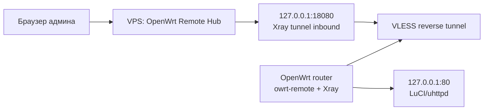

<div align="center">

# OpenWrt Remote Hub

**Легкий удаленный доступ к OpenWrt через свой VPS: карточки роутеров, online/offline, Xray reverse и локальная LuCI-интеграция без тяжелого VPN.**

[](https://openwrt.org/)
[](https://xtls.github.io/en/document/level-2/vless_reverse.html)
[](#быстрый-старт)

</div>

## Что это

`luci-app-owrt-remote` собирает схему "роутер за NAT -> VPS -> красивая панель -> админка роутера".

На роутере ставится маленький агент:

- пункт в LuCI: `Службы -> OpenWrt Remote`;
- `/usr/sbin/owrt-remote` для старта Xray reverse, heartbeat и генерации client config;
- `/etc/init.d/owrt-remote` для автозапуска через `procd`;
- локальная CGI-панель настройки, без Lua runtime.

На VPS запускается `vps/owrt-remote-hub.py`:

- веб-панель с карточками роутеров;
- online/offline по heartbeat;
- кнопка "Открыть админку";
- прокси к локальному Xray entry port, чтобы наружу не торчали админки всех роутеров;
- генерация server-side Xray config для нескольких роутеров.

ZeroTier, Tailscale и WireGuard тут не используются. Xray-бинарь в репозиторий не кладется, чтобы не занимать флешку OpenWrt.

## Как работает



1. Роутер сам подключается к VPS и держит reverse tunnel.
2. VPS-панель показывает карточку роутера и статус.
3. Когда нажимаешь "Открыть админку", хаб проксирует запрос в локальный entry port Xray.
4. Xray возвращает этот поток через reverse tunnel на LuCI роутера.

## Быстрый старт

### 1. VPS

На VPS нужен Python 3 и Xray. Скопируй папку `vps` на сервер и запусти:

```sh
sudo mkdir -p /opt/owrt-remote /var/lib/owrt-remote
sudo cp vps/owrt-remote-hub.py /opt/owrt-remote/
sudo chmod +x /opt/owrt-remote/owrt-remote-hub.py
sudo /opt/owrt-remote/owrt-remote-hub.py init
sudo /opt/owrt-remote/owrt-remote-hub.py add-router --id main --name "Главный роутер" --role main --entry-port 18080 --vps-host YOUR_VPS_DOMAIN_OR_IP
sudo /opt/owrt-remote/owrt-remote-hub.py render-xray --out /etc/xray/owrt-remote.json
```

Запусти хаб:

```sh
sudo OWRT_REMOTE_BIND=0.0.0.0 OWRT_REMOTE_PORT=8088 /opt/owrt-remote/owrt-remote-hub.py serve
```

Панель:

```text
http://YOUR_VPS_IP:8088/?token=ADMIN_TOKEN
```

`ADMIN_TOKEN` хаб покажет при первом `init`/`serve`, также он лежит в `/var/lib/owrt-remote/admin.token`.

### 2. OpenWrt

На роутере:

```sh
wget -O - https://raw.githubusercontent.com/kzolotarev95/luci-app-owrt-remote/main/install.sh | sh
```

После установки:

```text
LuCI -> Службы -> OpenWrt Remote
```

В VPS-панели открой карточку роутера и скопируй готовые UCI-команды из "OpenWrt config". Вставь их на роутер, затем:

```sh
/etc/init.d/owrt-remote enable
/etc/init.d/owrt-remote restart
owrt-remote heartbeat
```

## Что ставится на роутер

| Путь | Назначение |
| --- | --- |
| `/usr/sbin/owrt-remote` | CLI-агент: render config, heartbeat, status |
| `/etc/init.d/owrt-remote` | сервис автозапуска Xray reverse + heartbeat loop |
| `/www/cgi-bin/owrt-remote` | локальная красивая панель настройки |
| `/www/luci-static/resources/view/owrt_remote.js` | LuCI-страница-редирект |
| `/usr/share/luci/menu.d/luci-app-owrt-remote.json` | пункт меню LuCI |
| `/usr/share/rpcd/acl.d/luci-app-owrt-remote.json` | ACL для чтения web key |
| `/etc/config/owrtremote` | UCI-настройки агента |
| `/etc/owrt-remote/web.key` | приватный ключ локальной панели |

## Память OpenWrt

Сам модуль маленький: shell-скрипты, LuCI redirect и CGI. Самый тяжелый компонент - `xray-core`, но он не включен в этот репозиторий. Если на роутере мало флешки, лучше поставить Xray на extroot/USB или использовать сборку прошивки, где Xray уже включен.

## Команды агента

```sh
owrt-remote status
owrt-remote render-client
owrt-remote render-client --stdout
owrt-remote heartbeat
owrt-remote doctor
```

## Команды VPS-хаба

```sh
vps/owrt-remote-hub.py init
vps/owrt-remote-hub.py add-router --id main --name "Главный" --role main --entry-port 18080 --vps-host example.com
vps/owrt-remote-hub.py list-routers
vps/owrt-remote-hub.py render-xray --out /etc/xray/owrt-remote.json
vps/owrt-remote-hub.py print-openwrt-config --id main
vps/owrt-remote-hub.py serve --host 0.0.0.0 --port 8088
```

## Удаление

С роутера:

```sh
wget -O - https://raw.githubusercontent.com/kzolotarev95/luci-app-owrt-remote/main/uninstall.sh | sh
```

Полностью, вместе с конфигом:

```sh
wget -O - https://raw.githubusercontent.com/kzolotarev95/luci-app-owrt-remote/main/uninstall.sh | PURGE=1 sh
```

## Важное по безопасности

- Не открывай LuCI роутеров напрямую наружу.
- Entry ports Xray на VPS по умолчанию слушают `127.0.0.1`, а наружу отдается только dashboard.
- Панель хаба защищена `ADMIN_TOKEN`, а heartbeat от роутеров - отдельным `AGENT_TOKEN`.
- Для боевого режима лучше посадить dashboard за HTTPS reverse proxy: Caddy, Nginx или Traefik.
- Xray VLESS reverse можно усилить своим `xray vlessenc`; по умолчанию конфиг использует совместимый режим `none`.

