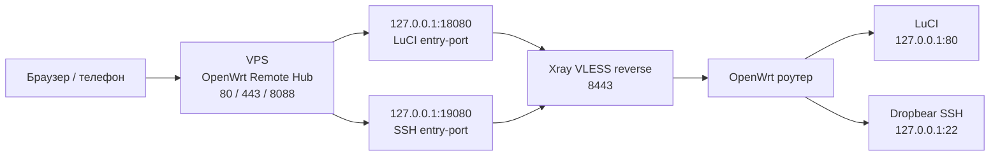

<div align="center">

# OpenWrt Remote Hub

Удаленный доступ к OpenWrt через свой VPS: карточки роутеров, online/offline, LuCI-админка, SSH web-terminal, Xray VLESS reverse-туннели и HTTPS.

<p>
  <a href="https://t.me/kzolotarev95"><b>Telegram</b></a>
  ·
  <a href="https://github.com/kzolotarev95"><b>GitHub</b></a>
  ·
  <a href="https://t.me/+LZDsQJhUfcNhYWEy"><b>NetHaven VPN</b></a>
</p>

<p>
  <a href="#быстрый-старт">Быстрый старт</a>
  ·
  <a href="#схема">Схема</a>
  ·
  <a href="#раскрыть-разделы">Разделы</a>
  ·
  <a href="#удаление">Удаление</a>
</p>

</div>

## Быстрый старт

### VPS: поставить Hub, Xray, firewall и HTTPS одной командой

```sh
curl -fsSL "https://raw.githubusercontent.com/kzolotarev95/luci-app-owrt-remote/main/vps/install-vps.sh?v=$(date +%s)" | sudo sh
```

После установки в конце будет вход:

```text
login:    admin
password: admin
```

Панель будет доступна так:

```text
https://YOUR_VPS_IP/
http://YOUR_VPS_IP/
http://YOUR_VPS_IP:8088/
```

Если нужен домен, передай его установщику:

```sh
curl -fsSL "https://raw.githubusercontent.com/kzolotarev95/luci-app-owrt-remote/main/vps/install-vps.sh?v=$(date +%s)" | sudo sh -s -- hub.example.com
```

Если HTTPS не нужен:

```sh
curl -fsSL "https://raw.githubusercontent.com/kzolotarev95/luci-app-owrt-remote/main/vps/install-vps.sh?v=$(date +%s)" | sudo env AUTO_HTTPS=0 sh
```

### OpenWrt: поставить агент на роутер

```sh
wget -O - "https://raw.githubusercontent.com/kzolotarev95/luci-app-owrt-remote/main/install.sh?v=$(date +%s)" | sh
```

Проверка на роутере:

```sh
owrt-remote doctor
owrt-remote status
```

## Схема



Роутер сам подключается к VPS изнутри сети. Наружу LuCI и SSH на роутере открывать не нужно.

## Что умеет

- красивые карточки роутеров на VPS;
- online/offline индикация;
- модель, OpenWrt, Xray, uptime, RAM, flash, температура и load;
- вход в LuCI кнопкой `Админка`;
- SSH прямо в браузере кнопкой `SSH`;
- готовые OpenWrt config-команды для каждого роутера;
- кнопки обновления и рестарта Xray на VPS;
- автоматический HTTPS на `443/tcp`, если firewall VPS открыт.

## Раскрыть разделы

<details open>
<summary><b>Установка VPS подробно</b></summary>

Команда установки:

```sh
curl -fsSL "https://raw.githubusercontent.com/kzolotarev95/luci-app-owrt-remote/main/vps/install-vps.sh?v=$(date +%s)" | sudo sh
```

Что делает установщик:

- ставит зависимости;
- скачивает Hub в `/opt/owrt-remote`;
- создает systemd-сервис `owrt-remote`;
- ставит Xray, если его нет;
- создает systemd-сервис `owrt-remote-xray`;
- открывает `80/tcp`, `443/tcp`, `8088/tcp`, `8443/tcp` в `ufw`;
- создает логин `admin` и пароль `admin`;
- пробует сразу включить HTTPS.

В свежем установщике в начале вывода должно быть:

```text
Installer: 2026-06-30-auto-https-v4
Жду запуск Hub...
```

Если хочешь поставить повторно, но не сбрасывать текущий пароль:

```sh
curl -fsSL "https://raw.githubusercontent.com/kzolotarev95/luci-app-owrt-remote/main/vps/install-vps.sh?v=$(date +%s)" | sudo env RESET_LOGIN=0 sh
```

Если HTTPS не включился автоматически, HTTP-панель все равно остается рабочей. После проверки firewall можно запустить:

```sh
curl -fsSL "https://raw.githubusercontent.com/kzolotarev95/luci-app-owrt-remote/main/vps/enable-https.sh?v=$(date +%s)" | sudo sh -s -- YOUR_VPS_IP
```

</details>

<details>
<summary><b>HTTPS / SSL</b></summary>

Установщик пытается включить HTTPS сам. Для этого должны быть открыты порты:

```text
80/tcp   - проверка Let's Encrypt
443/tcp  - HTTPS-панель
```

Включить HTTPS вручную на IP:

```sh
curl -fsSL "https://raw.githubusercontent.com/kzolotarev95/luci-app-owrt-remote/main/vps/enable-https.sh?v=$(date +%s)" | sudo sh -s -- YOUR_VPS_IP
```

Включить HTTPS вручную на домен:

```sh
curl -fsSL "https://raw.githubusercontent.com/kzolotarev95/luci-app-owrt-remote/main/vps/enable-https.sh?v=$(date +%s)" | sudo EMAIL="you@example.com" sh -s -- hub.example.com
```

Проверка на VPS:

```sh
sudo ss -lntp | grep -E ':(80|443|8088)\b'
curl -k https://127.0.0.1/health
```

Важно: IP-сертификаты Let's Encrypt короткие. Certbot ставит auto-renew, а скрипт добавляет hook для перезапуска Hub после обновления сертификата.

</details>

<details>
<summary><b>Добавить первый роутер</b></summary>

На VPS:

```sh
VPS_HOST="YOUR_VPS_IP"

sudo /opt/owrt-remote/owrt-remote-hub.py add-router \
  --id main \
  --name "Главный роутер" \
  --role main \
  --entry-port 18080 \
  --vps-host "$VPS_HOST"

sudo /opt/owrt-remote/owrt-remote-hub.py render-xray --out /etc/xray/owrt-remote.json
sudo systemctl restart owrt-remote-xray
```

Потом открой Hub, нажми у роутера `OpenWrt config`, скопируй команды и вставь их в SSH роутера.

Вывести команды прямо на VPS:

```sh
sudo /opt/owrt-remote/owrt-remote-hub.py print-openwrt-config \
  --id main \
  --hub-url "https://$VPS_HOST" \
  --vps-host "$VPS_HOST"
```

После вставки команд на OpenWrt:

```sh
owrt-remote render-client
/etc/init.d/owrt-remote enable
/etc/init.d/owrt-remote restart
owrt-remote heartbeat
```

</details>

<details>
<summary><b>Добавить второй и следующие роутеры</b></summary>

Каждому роутеру нужен свой `id` и свой `entry-port`.

Пример второго роутера:

```sh
VPS_HOST="YOUR_VPS_IP"

sudo /opt/owrt-remote/owrt-remote-hub.py add-router \
  --id node-2 \
  --name "Второй роутер" \
  --role node \
  --entry-port 18090 \
  --vps-host "$VPS_HOST"

sudo /opt/owrt-remote/owrt-remote-hub.py render-xray --out /etc/xray/owrt-remote.json
sudo systemctl restart owrt-remote-xray
```

Порты:

| Что | Пример | Для чего |
| --- | --- | --- |
| `entry-port` | `18080`, `18090`, `18100` | LuCI каждого роутера через VPS |
| `ssh-entry-port` | `19080`, `19090`, `19100` | SSH web-terminal, создается как `entry-port + 1000` |
| `vps-port` | `8443` | Xray VLESS reverse на VPS |
| `admin-port` | `80` | LuCI внутри OpenWrt |
| `ssh-port` | `22` | Dropbear/SSH внутри OpenWrt |

Наружу открывать надо только:

```text
80/tcp
443/tcp
8088/tcp
8443/tcp
```

Порты `18080`, `18090`, `19080`, `19090` должны слушать только `127.0.0.1` на VPS. Их наружу открывать не надо.

</details>

<details>
<summary><b>Установка агента на OpenWrt</b></summary>

На роутере:

```sh
wget -O - "https://raw.githubusercontent.com/kzolotarev95/luci-app-owrt-remote/main/install.sh?v=$(date +%s)" | sh
```

После установки:

```sh
owrt-remote doctor
owrt-remote status
```

Если Xray не помещается в память через `opkg`, можно поставить временный Xray в `/tmp` кнопкой `Поставить Xray в /tmp` в панели роутера. После ребута агент сам восстановит Xray в `/tmp`, если он пропал.

</details>

<details>
<summary><b>Проверка после установки</b></summary>

На VPS:

```sh
sudo systemctl status owrt-remote --no-pager -l
sudo systemctl status owrt-remote-xray --no-pager -l
sudo ss -lntp | grep -E ':(80|443|8088|8443|18080|18090|19080|19090)\b'
curl -sS http://127.0.0.1:8088/health
curl -k https://127.0.0.1/health
```

Должно быть:

- `owrt-remote` active/running;
- `owrt-remote-xray` active/running;
- `*:80`, `*:443`, `*:8088`, `*:8443`;
- `127.0.0.1:18080` для LuCI первого роутера;
- `127.0.0.1:19080` для SSH первого роутера.

На OpenWrt:

```sh
owrt-remote doctor
owrt-remote status
owrt-remote heartbeat
```

</details>

<details>
<summary><b>Частые проблемы</b></summary>

### Панель VPS не открывается

```sh
sudo systemctl status owrt-remote --no-pager -l
sudo journalctl -u owrt-remote -n 100 --no-pager
sudo ss -lntp | grep -E ':(80|443|8088)\b'
curl -sS http://127.0.0.1:8088/health
```

Если на VPS `curl` отвечает `{"ok":true}`, но снаружи сайт не открывается, проблема почти всегда в firewall VPS-провайдера.

Открой в личном кабинете VPS:

```text
80/tcp
443/tcp
8088/tcp
8443/tcp
```

### Админка пишет `proxy error: [Errno 111] Connection refused`

Пересобери Xray config:

```sh
sudo /opt/owrt-remote/owrt-remote-hub.py render-xray --out /etc/xray/owrt-remote.json
sudo systemctl restart owrt-remote-xray
sudo ss -lntp | grep -E ':(18080|18090|19080|19090)\b'
```

### SSH web-terminal просит пароль и молчит

Проверь Dropbear на OpenWrt:

```sh
/etc/init.d/dropbear status
owrt-remote heartbeat
```

В телефоне используй поле снизу терминала:

- `Вставить` - вставить текст;
- `Enter` - отправить Enter;
- `Отправить` - отправить команду или пароль.

### С мобильного интернета не открывается

Пробуй:

```text
https://YOUR_VPS_IP/
http://YOUR_VPS_IP/
http://YOUR_VPS_IP:8088/
```

Если по Wi-Fi работает, а через мобильный интернет нет, открой порты в firewall VPS-провайдера и проверь:

```sh
sudo ss -lntp | grep -E ':(80|443|8088)'
```

</details>

## Удаление

<details>
<summary><b>Удалить Hub с VPS полностью</b></summary>

```sh
curl -fsSL "https://raw.githubusercontent.com/kzolotarev95/luci-app-owrt-remote/main/vps/uninstall-vps.sh?v=$(date +%s)" | sudo sh
```

Удалится:

- `owrt-remote`;
- `owrt-remote-xray`;
- `/opt/owrt-remote`;
- `/etc/xray/owrt-remote.json`;
- `/var/lib/owrt-remote`;
- HTTPS systemd override и renewal hook;
- правила `ufw` для `80/tcp`, `443/tcp`, `8088/tcp`, `8443/tcp`.

Удалить Hub, но оставить базу роутеров:

```sh
curl -fsSL "https://raw.githubusercontent.com/kzolotarev95/luci-app-owrt-remote/main/vps/uninstall-vps.sh?v=$(date +%s)" | sudo env PURGE=0 sh
```

Удалить дополнительно сам Xray binary:

```sh
curl -fsSL "https://raw.githubusercontent.com/kzolotarev95/luci-app-owrt-remote/main/vps/uninstall-vps.sh?v=$(date +%s)" | sudo env REMOVE_XRAY=1 sh
```

</details>

<details>
<summary><b>Удалить агент с OpenWrt полностью</b></summary>

```sh
wget -O - "https://raw.githubusercontent.com/kzolotarev95/luci-app-owrt-remote/main/uninstall.sh?v=$(date +%s)" | PURGE=1 sh
```

Удалится:

- `/usr/sbin/owrt-remote`;
- `/etc/init.d/owrt-remote`;
- `/www/cgi-bin/owrt-remote`;
- пункт меню LuCI;
- rpcd ACL;
- `/etc/config/owrtremote`;
- `/etc/owrt-remote/web.key`;
- `/etc/xray/owrt-remote-client.json`.

Удалить только файлы панели, но оставить конфиг:

```sh
wget -O - "https://raw.githubusercontent.com/kzolotarev95/luci-app-owrt-remote/main/uninstall.sh?v=$(date +%s)" | sh
```

</details>

## Дерево проекта

<details>
<summary><b>Открыть дерево файлов</b></summary>

```text
.
├── install.sh
│   └── установка агента на OpenWrt
├── uninstall.sh
│   └── удаление агента с OpenWrt
├── files/
│   ├── usr/sbin/owrt-remote
│   │   └── CLI-агент, heartbeat, render-client, doctor
│   ├── etc/init.d/owrt-remote
│   │   └── procd-сервис OpenWrt
│   ├── www/cgi-bin/owrt-remote
│   │   └── веб-панель на роутере
│   ├── usr/share/luci/menu.d/luci-app-owrt-remote.json
│   │   └── пункт меню LuCI: Службы -> OpenWrt Remote
│   └── usr/share/rpcd/acl.d/luci-app-owrt-remote.json
│       └── права LuCI/rpcd
└── vps/
    ├── install-vps.sh
    │   └── установка Hub, Xray, firewall и HTTPS
    ├── enable-https.sh
    │   └── включение HTTPS/443 вручную
    ├── uninstall-vps.sh
    │   └── удаление Hub с VPS
    ├── owrt-remote-hub.py
    │   └── веб-панель VPS, карточки, proxy, SSH terminal
    └── owrt-remote.service
        └── systemd-сервис Hub
```

</details>

## Лицензия

MIT
